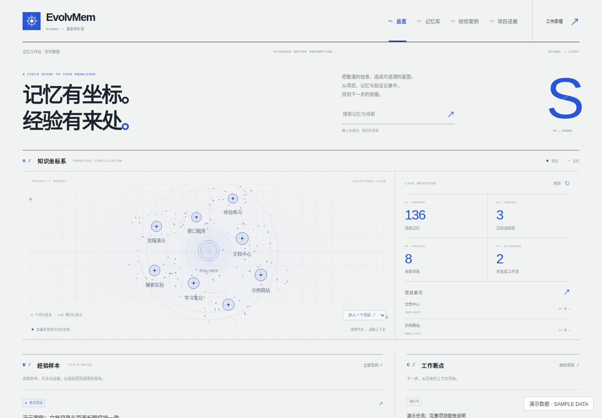

# EvolvMem

给编程 Agent 增加可查询、可核对、可续接的本地记忆。
EvolvMem 保存长期偏好、项目决策、故障经验和任务断点，供下一次会话按需读取。
它提供 SQLite 存储、中文全文检索、可选本地向量检索、stdio MCP 服务，以及中文 Web 工作台。

**“学习”发生在记忆和证据层。** 系统不会训练、微调或修改宿主模型权重。
一次检索命中不是成功经验；助手说“完成”也不是验证。方法需要关联真实工具结果或用户确认，才能形成可追溯的经验。

## 可以用它做什么

- 保存跨会话仍有价值的偏好、约束和技术决策，避免反复解释背景。
- 用关键词查中文记忆；装好本地 embedding 后，再补充语义相近的结果。
- 按条件检索经验，查看适用范围、方法、原始依据与后续反馈。
- 保存项目摘要和工作断点，让“继续上次任务”有明确的恢复位置。
- 在 Web 中浏览、筛选、整理项目归属，查看经验来源和未完成工作。
- 可选接入 Kimi / DSH 会话提取，把有长期价值的信息整理成候选记忆。

这些能力分阶段启用：默认 `legacy` 先提供基础记忆；结构化经验与续接依赖对应的 Context Core 模式、适配器和项目初始化。
自动调用依赖客户端遵循 MCP `instructions` 或运行 hooks，不保证每个 Agent 都主动查历史。
历史内容始终只是参考，不能覆盖当前用户要求或实际代码、测试结果。



界面预览使用演示数据。实际打开后显示自己的本地数据；新目录为空是正常状态。

## 运行环境

- Linux、macOS 或 Windows 的 WSL2；Python 3.10 及以上。
- Python 所链接的 SQLite 必须支持 FTS5、JSON 函数和聚合 FILTER，建议 SQLite 3.38 及以上。
- 原生 Windows 暂未支持：当前文件锁使用 POSIX `fcntl`，请在 WSL2 内安装和运行。
- 基础安装需要 pip 下载依赖；本地检索不需要提取模型的 API key。
- 默认面向个人和少量可信用户的本机使用；Web 默认监听 `127.0.0.1`，没有登录或 RBAC。

查看实际 Python / SQLite 版本：

```bash
python3 --version
python3 -c 'import sqlite3; print(sqlite3.sqlite_version)'
```

## 从零开始

### 1. 获取源码

在 [GitHub 仓库](https://github.com/1942293420/Evolvmem_MCP) 选择 Code → Download ZIP 并解压，或使用 Git 克隆：

```bash
git clone https://github.com/1942293420/Evolvmem_MCP.git evolvmem
cd evolvmem
```

### 2. 安装基础功能

```bash
bash install.sh
source .venv/bin/activate
python -m evolvmem.web_server
```

脚本在源码目录创建 `.venv`、检查运行环境、安装基础依赖，并在不存在时生成 `config.json`。
默认不下载模型，不安装可选 `llama-cpp-python`，也不覆盖已有配置或模型文件。
打开 http://127.0.0.1:9377 即可使用 Signal 工作台；终端按 Ctrl+C 停止服务。
MCP 由客户端另起进程，使用 MCP 不要求 Web 同时运行。

需要选择 Python 或虚拟环境目录时：

```bash
bash install.sh --python /absolute/path/to/python3 --venv /absolute/path/to/venv
```

喜欢手工安装，也可以在源码目录执行：

```bash
python3 -m venv .venv
source .venv/bin/activate
python -m pip install -e .
python -m evolvmem.web_server
```

手工安装后，运行服务会创建需要的数据目录；未创建 `config.json` 时使用代码默认值。
配置样例使用虚拟环境 Python 的绝对路径，避免客户端启动到另一个没有安装 EvolvMem 的解释器。

### 3. 可选：启用本地语义检索

```bash
bash install.sh --with-embedding
```

这会额外安装 `llama-cpp-python` 并下载 Nomic GGUF；后端安装可能需要 C/C++ 编译环境。
默认模型为 `nomic-embed-text-v1.5.f16.gguf`，维度 768，文件位于数据目录的 `models/`。
查询和文档分别加 `search_query: ` 与 `search_document: ` 前缀。
这些字段共同定义向量空间，不能只随意修改维度；更换模型后需按技术参考重建相应缓存。
没有模型或加载失败时，基础记忆仍能使用 FTS5/trigram；`primary` 还受独立的索引健康门禁约束。

## 数据目录与配置

默认目录是 `~/.claude/evolvmem/`。这个历史路径名不要求安装 Claude Code，其他客户端也能共用。
如需独立目录，先设置环境变量，再安装或启动各个客户端/服务：

```bash
export EVOLVMEM_DATA_DIR="$HOME/.local/share/evolvmem"
bash install.sh
.venv/bin/python -m evolvmem.web_server
```

MCP、hooks、补扫 worker 必须指向同一目录；桌面客户端未必继承终端变量，建议写入其 MCP `env`。
`config.json` 的缺失字段使用默认值；`EVOLVMEM_CONTEXT_MODE`、`EVOLVMEM_ADAPTER` 优先于其中对应字段。
修改配置后重启已有服务。Kimi 路径常量在进程导入时解析，运行中改变变量不会切换目录。
完整的 65 个默认参数见 [config.example.json](examples/config.example.json)，其中不含数据路径或凭据。
初次配置可参考它；已有数据目录只改需要的字段，不要用样例覆盖自己的完整配置。

| 文件 / 目录 | 用途 |
|---|---|
| `config.json` | 模式、检索、注入预算、保留和合并参数 |
| `memory.db` | SQLite 内容、索引、项目和任务状态 |
| `vectors.usearch` / `context_vectors.usearch` | 两份独立、可重建的向量缓存 |
| `models/` | 可选本地 GGUF 模型 |
| `llm_credentials.json` | 可选提取聊天模型凭据 |
| `hooks.log` / `live/` | hook 诊断日志和会话心跳 |
| `session_archives/` / `archive.key` | AES-GCM 加密会话证据；密钥权限为 `0600` |
| `workspace.key` | 工作区指纹密钥，用于项目绑定和续接 |
| `backups/` | 正式切换备份；不会自动清理 |

原始 Kimi 会话仍从 `~/.kimi-code/sessions` 读取，数据目录变量不会移动宿主的会话来源。
现有 `project_cli` / `maintenance_cli` 的 `--data-dir` 选择操作库，但不会同步传给共享 LLM 凭据加载器；它们还会在执行期间清除目录环境覆盖。
因此不能用该参数承诺凭据也随之切换。自定义库的模型提取建议从设置好环境变量的 hook/MCP 流程启用；手工 CLI 需单独核对凭据来源。

## 三种“模型”各做什么

| 角色 | 谁负责配置 | 是否必需 |
|---|---|---|
| 宿主模型 | Codex / Claude / Kimi / DSH 自己的设置 | 使用对应 Agent 时需要；EvolvMem 不替它登录或选模型 |
| 提取聊天 LLM | `llm_credentials.json` | 可选，用于会话提取、滚动摘要、合资格的方法生成等 |
| 本地 embedding | `config.json` 和 `models/` | 可选，将文本编码为向量用于语义检索，不负责聊天 |

未配置提取 LLM 时，已有记忆读取、手工写入、全文检索、页面浏览和已就绪的续接功能仍可用。
未配置 embedding 时，缺少语义检索、向量近重复合并等能力；结构化工具是否可用还取决于运行模式。
页面的部分整理建议先采用确定性规则，规则足够时未必调用 LLM。点击页面或看到建议不等于已经发出模型请求。
缺少 LLM 时，提取返回待重试，滚动摘要和方法生成报告降级，不会假装生成成功。

### 配置提取聊天模型

选择一个样例，复制到实际数据目录并填写自己的 key：

```bash
EVOLVMEM_ROOT="${EVOLVMEM_DATA_DIR:-$HOME/.claude/evolvmem}"
mkdir -p "$EVOLVMEM_ROOT"
# 仅首次创建；文件已存在时直接编辑，不覆盖它。
test -e "$EVOLVMEM_ROOT/llm_credentials.json" || \
  cp examples/llm_credentials.deepseek.example.json "$EVOLVMEM_ROOT/llm_credentials.json"
chmod 600 "$EVOLVMEM_ROOT/llm_credentials.json"
```

DeepSeek 示例（[文件](examples/llm_credentials.deepseek.example.json)）：

```json
{
  "provider": "deepseek",
  "api_key": "REPLACE_WITH_YOUR_DEEPSEEK_API_KEY",
  "base_url": "https://api.deepseek.com/chat/completions",
  "model": "deepseek-v4-flash"
}
```

Kimi 示例见 [llm_credentials.kimi.example.json](examples/llm_credentials.kimi.example.json)：
`provider="kimi"`，endpoint 为 `https://api.kimi.com/coding/v1/chat/completions`，模型为 `kimi-for-coding`。
`api_key` 必填；`provider` 缺省为 DeepSeek，`model` / `base_url` 缺省使用该 provider 的代码默认值。
模型是否对自己的账号开放，仍以供应商为准；DeepSeek 请求格式见 [官方接口文档](https://api-docs.deepseek.com/api/create-chat-completion/)。

**`base_url` 必须是完整请求 endpoint**，代码直接 POST 到该地址，不会自动补 `/v1` 或 `/chat/completions`。
目前 provider 仅接受 `deepseek` 和 `kimi`；自定义 endpoint 也必须兼容所选 provider 的请求体，不能理解为任意 OpenAI-compatible 服务都受支持。
不会自动读取宿主登录 key，也没有 `OPENAI_API_KEY` 等凭据环境变量 fallback；不会自动在两个 provider 间切换。

启用提取后，经过脱敏的会话副本会发送给配置的供应商；脱敏不等于删除所有业务机密，启用前应确认会话内容适合发送。
原始会话归档保留在本地并加密，和发给模型的副本不同。提取、摘要、方法生成及重试可能分别产生请求和费用。
超长会话仅在明确的上下文窗口错误后分块；认证、配额、网络或无效结果等错误不会记为提取成功。

## 接入编程客户端

所有样例都从 `legacy` 开始。先替换样例中的 `/absolute/path/evolvmem` 和 `/absolute/path/evolvmem-data`，分别对应源码/环境位置和数据目录。
样例是需要合并的片段，不要覆盖客户端现有配置；修改后创建新会话，确认 EvolvMem 工具已经连接。

### Codex

把 [codex.example.toml](examples/codex.example.toml) 合并到 `~/.codex/config.toml`：

```toml
[mcp_servers.evolvmem]
command = "/absolute/path/evolvmem/.venv/bin/python"
args = ["-m", "evolvmem.mcp_server"]

[mcp_servers.evolvmem.env]
EVOLVMEM_DATA_DIR = "/absolute/path/evolvmem-data"
EVOLVMEM_ADAPTER = "codex"
EVOLVMEM_CONTEXT_MODE = "legacy"
```

用 `codex mcp list` 查看注册状态，`codex mcp get evolvmem` 查看该条目；新会话里先调用 `memory_status`。
配置格式以 [Codex 官方 MCP 文档](https://developers.openai.com/codex/mcp/) 为准。
升级到 Core 后，可按项目需要合并 [AGENTS.memory.md](examples/AGENTS.memory.md)，帮助 Agent 规范查询、保存断点与记录证据。

### Claude Code

将 [claude.mcp.example.json](examples/claude.mcp.example.json) 合并为工作区根目录的 `.mcp.json`，或用 `claude mcp add` 注册。
MCP 不放在旧式 `settings.json.mcpServers` 位置；客户端配置范围见 [Claude 官方 MCP 文档](https://code.claude.com/docs/en/mcp)。
若需要 SessionStart 注入，把 [claude.hooks.example.json](examples/claude.hooks.example.json) 的 `hooks` 合并到 `.claude/settings.json` 或用户级 `~/.claude/settings.json`。
这里使用 `SessionStart → hooks 数组 → type=command` 结构，命令读取 stdin 的 `cwd` 并打印上下文；格式见 [官方 hooks 文档](https://code.claude.com/docs/en/hooks)。
Claude 的 `adapter=claude` 目前暴露基础 memory 工具，不因为改为 primary 就获得 Core MCP 工具；通用 SessionStart helper 可尝试 Core，失败后回退旧格式。
本仓库没有用 Claude Stop hook 自动完成提取的成套接线；不要把 Kimi SessionEnd 样例直接当作 Claude 转写读取器。

### Kimi Code CLI

把 [kimi.mcp.example.json](examples/kimi.mcp.example.json) 合并到 `~/.kimi-code/mcp.json` 或工作区 `.kimi-code/mcp.json`。
新会话中用 `/mcp` 检查连接；配置说明见 [Kimi 官方 MCP 文档](https://moonshotai.github.io/kimi-code/en/customization/mcp.html)。
把 [kimi.hooks.example.toml](examples/kimi.hooks.example.toml) 的 `[[hooks]]` 条目合并到 `~/.kimi-code/config.toml`。
SessionStart 注入已有记忆，SessionEnd 触发可选的付费提取，SessionHeartbeat 为补扫 worker 标记活跃会话。
当前 [Kimi hooks 官方格式](https://moonshotai.github.io/kimi-code/en/customization/hooks) 直接使用 `event`、`command`、可选 `matcher` / `timeout`，不要添加 `actions` 数组。
只需要读取时可不加入 SessionEnd；需要提取时先配置上面的 `llm_credentials.json`。

### DSH

仓库提供 [DSH bundle 接入说明](dsh/README.md) 和 `dsh/cordis.patch.yml`，包含 MCP、一次性注入、会话提取和闲置补扫组件。
它依赖 DSH 宿主的 bundle/profile 机制，不是独立 Node 服务。现有 patch 使用 primary；已有库应先完成迁移及健康验证。

## 验收第一条记忆

在已连接的客户端里，让 Agent 调用 `memory_status`，再要求保存下面这条演示偏好：

```json
{
  "key": "demo:preference:communication:language",
  "value": "项目沟通默认使用中文，技术标识保留原文。",
  "attribute": "preference",
  "tier": "pinned"
}
```

这是 `memory_add` 的参数，不是写入 config.json 的内容。随后用 `memory_search` 查询“项目沟通”。
核对返回 ID、内容及 Web 记忆库中的记录；新会话是否自动出现，取决于是否启用了相应注入机制。
验证后可用该返回 ID 调用 `memory_remove` 软删除演示记录。基础安装到这一步不需要提取 LLM 或 GGUF。

## 启用 Context Core、经验和任务续接

| 模式 | 当前行为 |
|---|---|
| `legacy` | 默认基础记忆，六个 memory 工具；不提供结构化 Core/continuity 工具 |
| `compat` | Core 成为规范写入层，保持旧投影读取；支持适配器可列出 continuity 工具 |
| `shadow` | 显式 Core/经验查询可用，向量可选；不发 primary 自动召回指令 |
| `primary` | Core 健康时提供结构化读取及自动召回指令；不变量失败时收紧工具和写入 |

结构化 MCP 适配器为 `codex`、`kimi`、`dsh`，模式与适配器需要同时配置。
仅把 `context_mode` 改成 primary，不会自动迁移历史数据或保证索引健康。
未知模式 fail-closed；降级 primary 仍可提供诊断和独立续接工具，但不应承诺其他写入成功。

**已有库升级请按 [Codex Context Core 切换手册](docs/codex-context-core-runbook.md)**，执行 preflight、预览、备份、迁移和验收。
该流程会区分持久化 compat 与单个 Codex 进程的 primary；不要跳过检查，直接照抄开关到所有客户端。
Core 的 L0 是检索摘要，L1 是有预算的注入详情，L2 是通过精确 ID 读取的完整内容；详见 [技术参考](docs/context-core.md)。

### 为项目建立工作区绑定

需要项目归属或续接前，先使用实际工作区绝对路径完成以下步骤：

```bash
python -m evolvmem.project_cli bootstrap-key
python -m evolvmem.project_cli projects register demo
python -m evolvmem.project_cli fingerprint /absolute/path/to/workspace
# 将上一条输出的 fingerprint 填在下一条命令中。
python -m evolvmem.project_cli bindings bind FINGERPRINT_FROM_PREVIOUS_COMMAND demo --default
```

这些命令登记项目和工作区指纹；不能单靠项目名猜出绑定，`workspace.key` 也不能随意重新生成。
在支持的模式中，让 Agent 先 `context_session_start` 或 `continuity_resume` 获取当前状态，再按最新 revision 创建/更新 checkpoint。
“继续”读取精确的工作流指针；没有绑定、没有焦点或工作区变化时，先处理返回状态，不把相似记忆冒充原任务。

### 工具速查

| 工具 | 用途 |
|---|---|
| `memory_search` / `memory_status` | 基础查询与运行状态 |
| `memory_add` / `memory_replace` / `memory_remove` | 手工新增、替换、软删除 |
| `memory_consolidate` | 向量近重复整理，默认 dry-run |
| `context_session_start` / `context_search` / `context_read` | 有预算的历史块、L0 搜索、按 ID 读 L1/L2 |
| `context_status` | Core 就绪状态、投影和向量诊断 |
| `experience_recall` / `experience_record` | 按条件找经验，保存有来源的方法 |
| `context_confirm` / `context_record_outcome` | 候选确认及使用、成功、失败、不适用等反馈 |
| `continuity_resume` / `continuity_checkpoint` / `continuity_list` | 恢复、保存、列出工作断点 |
| `context_archive_project` / `context_sweep` | 项目原始归档清理和 TTL 扫描 |

工具是否列出由当前 mode、adapter 和健康状态决定，以客户端实际 `tools/list` 为准。
写操作是否要求确认（write approval）由客户端策略决定；工具注解不会替用户批准变更。
候选经验需确认或满足证据规则后才生效；查看页面、检索到案例、引用案例都不自动算成功。
向量缓存是派生数据，SQLite 是内容依据；原始归档清理和 Web 硬删除具有不可逆影响，详情见技术参考。

## Web 工作台与运行维护

默认首页 Signal 包含总览、记忆库、经验案例和项目进展，可查看项目星图、筛选记录、核对来源和复制续接提示。
记忆整理支持编辑元信息、归档/恢复/删除、项目归属建议与人工确认；经验/进展页需要实际 Core 数据，空列表不代表安装失败。
`/workflow` 展示记忆如何写入、检索、验证和续接；它是说明页面，不会因为打开页面就自动执行图中的步骤。
自定义监听端口可用 `python -m evolvmem.web_server --port 9378`；需要可信内网访问时可显式加 `--host 0.0.0.0`。

Kimi 异常退出未触发 SessionEnd 时，可以另行运行 `python scripts/extract_stale_sessions.py` 补扫。
它使用相同凭据和提取规则，默认检查闲置至少 30 分钟的会话，每轮最多处理 3 个；不属于纯离线、无模型费用的整理。
未成功的会话版本保持待重试；配置定时任务时同时指定解释器、数据目录、日志和避免重叠执行的锁。

| 现象 | 先检查 |
|---|---|
| 客户端找不到模块 | MCP command 是否指向安装本项目的 `.venv/bin/python`；路径是否替换完整 |
| 只有 memory 工具 | 默认 legacy 正常如此；Core 还需模式、支持的 adapter 和健康状态 |
| 显示 FTS-only | 基础安装正常；需要语义检索再安装 embedding 后端及 GGUF |
| `degraded_legacy` | 看 context_status 的映射、层、投影、dirty/count 等原因，按切换手册处理 |
| `continuity_not_ready` / `project_unresolved` | 核对 workspace.key、schema、工作区指纹和项目绑定 |
| 提取不写入 | 检查会话是否过短、凭据文件位置、provider、完整 endpoint、配额及 hooks.log |
| 摘要未更新 | 查看 llm_unavailable / unchanged / no_sources 等原因；原摘要会在失败时保留 |

## 开发、分享与许可

```bash
source .venv/bin/activate
python -m pip install -e '.[dev]'
python -m pytest -q
python scripts/sync_readme.py
python scripts/sync_readme.py --check
```

`README.md` 是唯一编辑源，`README.txt` 是同内容纯文本版；同步脚本保留链接地址和代码，不需要额外 Markdown 依赖。
普通测试不调用收费模型；需要实模/真实客户端的验收请单独阅读相应测试或脚本说明。
公开导出可运行 `python scripts/export_source.py --output dist/evolvmem-github`，生成目录和 ZIP；操作步骤见 [GitHub 分享说明](docs/github-sharing.md)。
不要把自己的数据库、会话、密钥、凭据或本地运行日志加入源码分享包；样例中的 key 和绝对路径均为待替换占位值。

目前尚未指定覆盖全项目的许可证，不能把公开源码理解为已授予 MIT 等通用授权。
DSH 子包与第三方资源保留各自声明；来源和许可见 [THIRD_PARTY_NOTICES.md](THIRD_PARTY_NOTICES.md)。
