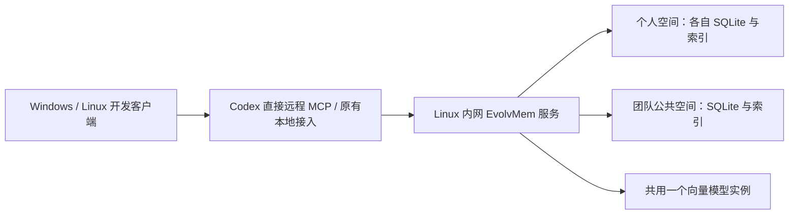

# EvolvMem 内网多用户与 Windows 接入方案

日期：2026-09-15。状态：开发、源码审查、备份和服务切换已完成，内网 MCP 已启用，GitHub 已推送；Windows 实机接入尚待验收。
业务目标：你和 Kane 从 Windows/Linux 使用同一套内网记忆服务，共用一个向量模型，个人记忆隔离，团队经验可主动共享。
运行规模：可信内网、Linux 单机单进程；首版个人用户固定为 jiangli、kane，保留公共区。Windows 优先 Codex；Kane 只配置远程 MCP，jiangli 保留现有 Linux 工作方式。

## 选择

| 路径 | 收益 | 成本与限制 | 建议 |
| --- | --- | --- | --- |
| Linux 服务 + Windows 轻量接入器 | 集中存储与模型，保留本机 Git/会话接入 | 需要远程传输和本地信息采集适配 | 后续需要完整本机采集时再采用 |
| Linux 服务 + Windows 只配远程 MCP | 最少客户端组件，可调用远程记忆工具 | 无法自行读取 Windows 仓库和会话，功能不完整 | 按用户最新要求作为 Kane 首版接入方式 |
| 每台 Windows 完整运行 EvolvMem | 各机可独立工作 | 模型与原生依赖重复部署，共享与同步另做 | 后续有离线需求再评估 |

## 实施前代码基线

- `evolvmem/mcp_server.py` 目前是 stdio 子进程入口；存在 Linux `fcntl` 索引重建锁，不能直接宣称已兼容原生 Windows。
- `evolvmem/context_models.py` 的 `project/global` 是项目适用范围，不是用户可见性；当前核心数据没有个人空间路由。
- `evolvmem/web_auth.py` 是单一 owner 可写、其他允许用户可读；该机制不等于多用户个人数据隔离。
- `evolvmem/workspace_identity.py` 和 `continuity_service.py` 依赖服务所在机器的目录与 Git。
- PRIMARY 向量门禁与基础工具可用性耦合；上一轮 7 项隔离测试验证了相关边界，并未验证本方案已实现。

## 目标结构

- Kane 的 Codex 直接连接 Streamable HTTP MCP；jiangli 保留已有 Linux 接入方式，按需复用服务器的向量接口。
- 一个服务进程管理多个空间，模型由进程统一持有，不能按用户、连接或请求重复创建。
- 首版沿用现有 Nomic 模型与向量契约，减少模型迁移变量；以后适配 EVA TEI 时独立验收并重建索引。
- 所有空间的向量维度、前缀和模型版本由服务统一管理；向量索引是可重建缓存，SQLite 保存事实。
- 禁用或加载失败时，基础读写、全文检索、任务续接仍可用；待生成的向量不能使个人记忆服务整体停用。
- 只有向量能力会降级；真实数据库完整性错误仍按现有原则处理。

## 用户与数据空间

- 首版分为 `jiangli` 个人空间、`kane` 个人空间、团队公共空间；每个空间独立数据库与向量索引文件。
- 共用模型无需把所有人的向量混入同一个索引；分空间复用现有单库逻辑，降低全链路漏过滤的可能。
- 每位用户使用单独接入凭据，服务端把凭据映射为固定用户 ID；请求里的用户名、路径、项目名不决定身份。
- 默认写入自己的个人空间；默认搜索范围为自己的个人空间与公共空间，也可只搜其中一个。
- 先确定可访问空间，再做全文/向量检索和结果合并；不先检索所有用户再删除越权结果。
- 读详情、替换、删除、经验反馈、来源证据、会话档案、续接、导出及页面统计都使用相同空间路由。
- 对外记录引用必须带空间信息，避免个人条目 123 与公共条目 123 冲突；不得凭裸 ID 跨空间读取。
- 公共区面向本次配置的内网团队，默认成员均可读；成员可主动发布自己的条目，修改/撤回限作者或维护者。
- 发布产生独立的公共条目；默认只发布整理后的结论和可共享证据，完整对话、个人偏好、凭据与私有来源留在个人区。
- 公共条目不提供能越过权限读取私有会话的来源链接；私人合并与公共合并分别执行。
- 现有 Web 页面展示个人/公共数据时也必须通过空间路由；现有 viewer 身份不能默认获得新个人库读取权。
- 用户管理先采用服务器上的小型凭据与用户映射配置，不扩展部门、复杂角色或审批平台。

## Windows 功能对应

| 能力 | 服务器职责 | Windows Codex 职责 |
| --- | --- | --- |
| 记忆写入、检索、读取、经验复用 | 数据持久化、检索、工具返回 | Codex 根据 MCP 指令调用工具 |
| 任务续接 | 保存断点、版本校验、返回候选 | 识别本机工作区、采集 Git 状态 |
| 会话信息留存 | 保存明确提交的总结与断点 | Codex 调用 MCP；首版不采集 Windows 原始日志 |
| 公共经验发布与读取 | 共享条目、作者信息、可见范围 | 用户明确指定发布或检索公共区 |
| 浏览器管理 | 保留 jiangli 现有入口；新用户首版使用 MCP | 不新增 Windows 网页管理入口 |

- Kane 无需安装本地接入程序、llama、GGUF 或虚拟机；只配置 MCP 地址和个人凭据。
- jiangli 沿用原有 hook；Kane 通过 Codex 的 MCP 使用指令提交记忆和断点，首版不额外采集 Windows 会话日志。
- 首版目标为 Windows 10/11 x64 的 Codex；其他宿主分别验收后才声明支持。
- 同一项目的 Windows 与 Linux 目录通过显式绑定关联稳定项目 ID，不使用目录名相同作为自动归属依据。
- 远程工作区使用逻辑标识；需要 Git 状态时由 Codex 在本机检查并作为来源明确的参数提交，服务器不读取 Windows 路径。
- Git 检查结果标记为客户端采集；缺失仓库证据时保留未核实状态，不能伪装为服务端已校验。
- 同一用户可选择接续同一任务；默认焦点按用户和工作区/设备区分，继续保留 revision 校验，不同用户不共用个人焦点。
- 服务断连时返回明确的不可用状态，宿主可继续开发；不报告保存成功，不自动另建离线库或多端双向同步。
- 写入请求具有用户范围内的稳定请求标识，响应丢失后重试不能重复创建记忆或公共条目。

## 迁移与交付顺序

1. 用临时双用户数据验证空间路由及无模型运行，打通内网 MCP 的写入—读取闭环。
2. 接入现有共享模型实例，完成个人与公共检索、发布、修改/撤回与来源边界。
3. 完成 Codex 直接远程 MCP 配置、工作区绑定和续接；保持 jiangli 现有 Linux 使用方式。
4. 使用原库的一致性副本做迁移演练：已有记录、档案、密钥、绑定和断点归入你的个人空间，公共库初始为空。
5. 验证现有 Linux 客户端使用新的服务入口，旧本地进程不再同时写入迁移后的库；再执行正式切换。
6. 按项目约定同步架构图、说明、验收结果和源码发布；真实 Windows 联调未完成前只标记候选版本。

## 业务验收

- 你和 Kane 分别写入独有标记；对方的全文搜索、语义搜索、精确 ID 读取、来源、统计和页面均无法取得私有记录。
- 你明确发布一条公共经验后，Kane 可以搜到并读取公共内容；仍无法借公共来源读取你的完整私人会话。
- Kane 不能修改你的个人条目或你发布的公共条目；作者撤回公共条目后，其他用户的后续请求不再返回它。
- 两位用户在同一项目工作的断点互不覆盖；同一用户从 Linux 到 Windows 可在核对仓库状态后接续指定任务。
- Codex 完成远程身份配置、工作区绑定、记忆写入和重启后续接；Windows 实机结果与 Linux 协议联调结果分别记录。
- 多个用户/客户端接入时，服务只持有一个模型实例；模型关闭时基础功能正常，服务断连时不产生虚假成功。
- 旧数据导入后记录、证据引用与既有任务可读；历史内容不会因为迁移自动进入公共区。

## 已确认范围与边界

- 用户已批准本方案并要求使用 Superpowers 开发；实现、测试、发布结果按实际进度记录。
- 已确认：仅 jiangli、kane 两个个人用户，保留公共区；除 jiangli 外直接连接 MCP。
- 已确认：Linux 集中运行、个人/公共空间分开、默认个人写入、主动发布公共。
- 首版不做完整 Windows 服务端移植、离线双向同步、多实例、独立向量数据库集群或复杂角色体系。
- 参考：[MCP 官方传输规范](https://modelcontextprotocol.io/specification/2025-11-25/basic/transports)。

## 执行计划（Superpowers，测试先行与独立审查）

### Task 1: 分空间与共享模型基础
- 修改 `config.py`、`context_service.py`、`mcp_server.py`；新增 `lan_config.py`、`lan_runtime.py`。
- 配置固定两位用户与公共目录，认证凭据映射身份；每个空间创建真实 Context/Memory 服务，共用一个可选模型；环境变量不得覆盖空间归属。
- 新增 `tests/test_lan_runtime.py` 验证双用户写读隔离、公共空间独立、模型只初始化一次、关闭与缺失模型仍可写读、核心数据库错误仍拦截；先红后绿并审查提交。

### Task 2: 远程 MCP 与公共经验闭环
- 新增 `lan_server.py`、`lan_tools.py`、`lan_sharing.py`，实现身份验证后的 Streamable HTTP、空间选择、发布/撤回、来源边界与写入幂等。
- 保持核心 MCP 工具注册表行为；远程路径不触发服务端文件读取；公共条目用空间与 ID 联合引用，个人数据默认隔离。
- 新增 `tests/test_lan_server.py`、`tests/test_lan_sharing.py`，通过 HTTP 验证两人独有标记、公共发布与撤回、越权 ID/用户参数拒绝、重复请求无重复写；先红后绿并审查提交。

### Task 3: 远程续接与原有 Linux 兼容
- 修改 `continuity_service.py` 的工作区/仓库采集边界，新增远程上下文适配；Linux 旧 MCP 入口可转发到同一服务，保留本地默认行为与公共工具。
- 远程 Codex 使用逻辑工作区与客户端采集的 Git 元信息；真实缺失证据保留未知状态，焦点和版本按个人空间隔离。
- 增加共享向量 HTTP 适配供 jiangli 原有入口复用，避免为兼容再加载模型；新增续接和向量接口集成测试，先红后绿并审查提交。
- 已复现原有 hook 与长期服务的索引覆盖问题；仅在 LAN 模式增加本地索引增量合并与读刷新，保留原单机默认行为，切换前退出旧记忆子进程。

### Task 4: 接入交付、图文与发布
- 提供固定双用户的服务器配置/启动入口及 Codex 配置示例；凭据只保存在本机私有文件，示例使用占位值。
- 维护现有架构图源、README、导出名单和飞书方案；完成临时库联调、现有库兼容检查、服务健康验证及源码审查。
- 提交本地 Git 并按现有公开范围推送 GitHub；Kane 获得 MCP 地址与凭据交付文件，真实 Windows 未联调部分如实标记，不冒充已验收。

交付核验：`3c976c2` 已部署并推送 GitHub main，完整测试 2147 通过、3 跳过。已备份并切换服务，实际私有隔离、共享发布/撤回、原入口和 66 份归档解密验证通过；仅一个进程加载模型，Web 与 MCP 均启用自启动。Kane 入口为 `http://192.168.1.135:9378/mcp`，专属凭据按私有说明交付。Windows 实机仍待验收，飞书原画板暂不替换。
